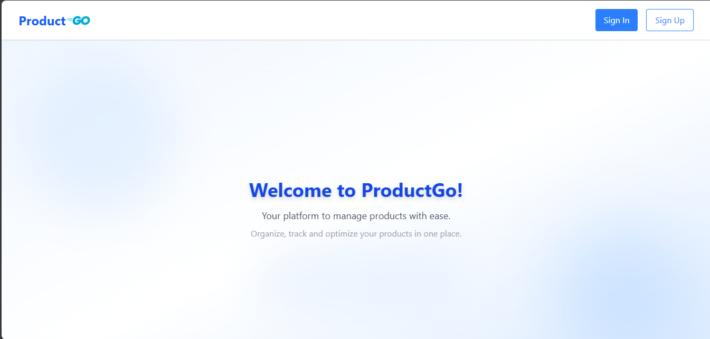
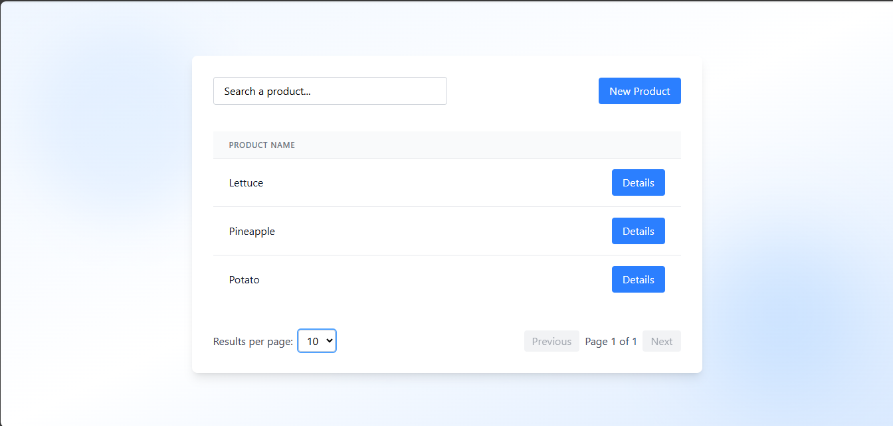
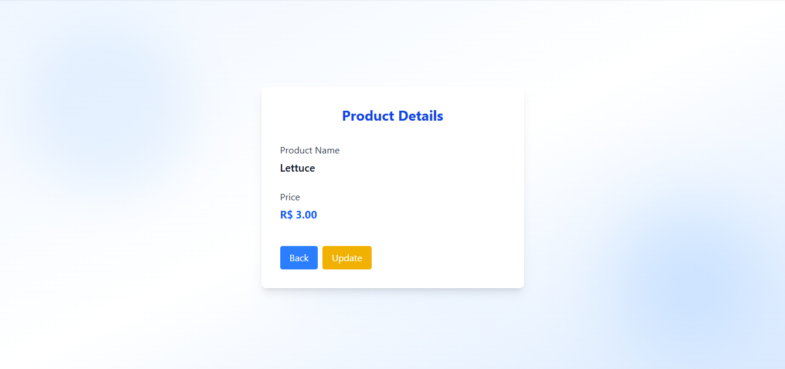
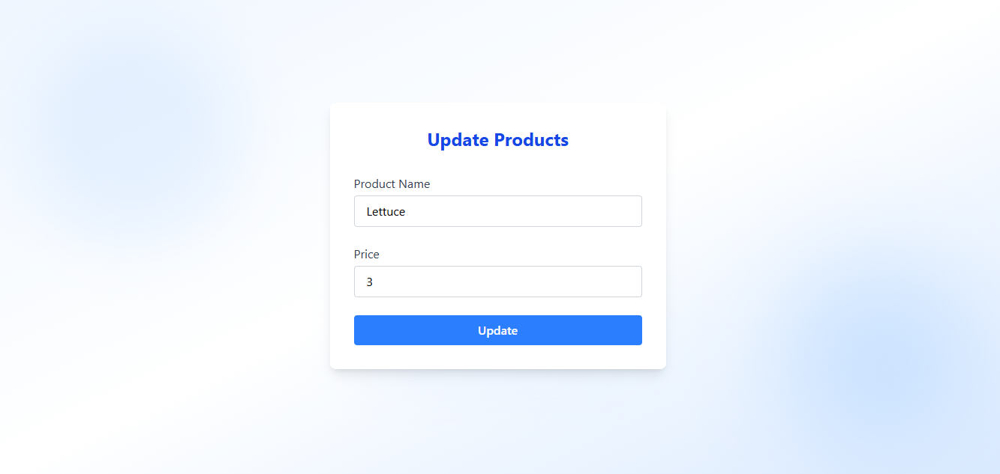
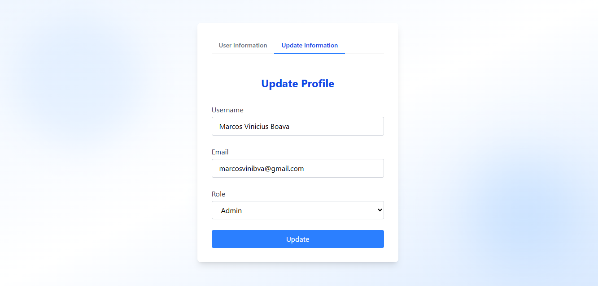
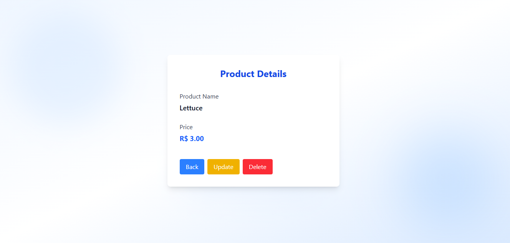
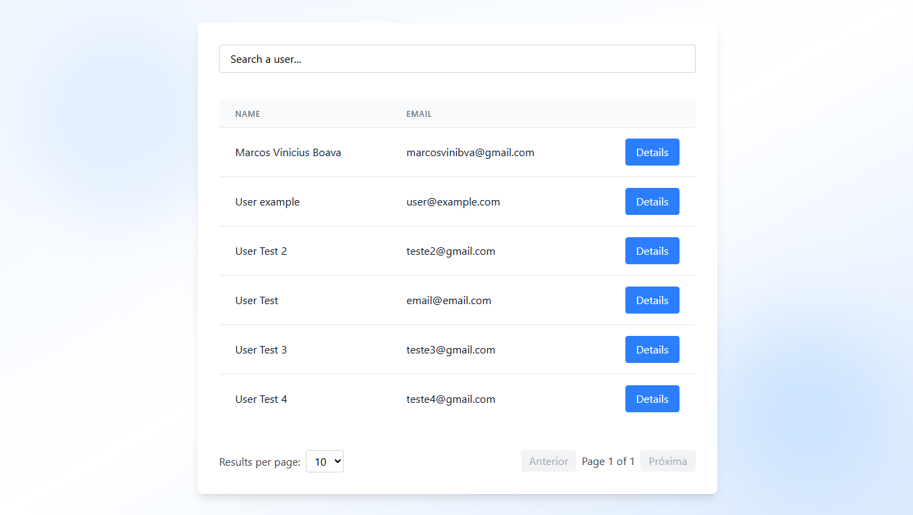

# ProductGoFrontend

Frontend para o projeto Product Go API. Construído com Angular, oferece uma interface amigável para gerenciamento de produtos e usuários, consumindo a API RESTful desenvolvida em Go.

---

## Estilização 🖌️

Este projeto utiliza [Tailwind CSS](https://tailwindcss.com/) para estilização rápida e moderna.  
Você pode customizar ou estender os estilos como desejar.

---

## Table of Contents 📋

- [Requisitos](#requirements)
- [Configurações do Ambiente](#environment-setup)
- [Scripts](#scripts)
- [Funcionalidades](#features)
- [Endpoints Consumidos](#endpoints-consumed)
- [Estrutura de Pastas](#folder-structure)
- [Screenshots](#screenshots)
- [Versão EN-US](README.md)

---

## <span id="requirements">Requisitos 📄</span>

- Node.js 18+
- npm 9+
- Angular CLI 20+
- O [Product Go API backend](https://github.com/Mfrozzz/product-go-api) executando e acessível

---

## <span id="environment-setup">Configurações do Ambiente ⚙️</span>

1. **Clone o repositório:**

   ```sh
   git clone https://github.com/Mfrozzz/product-go-frontend.git
   cd product-go-frontend
   ```

2. **Instale as dependências:**

   ```sh
   npm install
   ```

3. **Configure as variáveis de ambiente:**

   - Edite o `src/environments/environment.development.ts` e coloque a `apiUrl` correta para apontar para o seu backend (padrão: `http://localhost:8000`).

4. **Inicie o servidor de desenvolvimento:**

   ```sh
   ng serve -o
   ```

   O app estará disponível em [http://localhost:4200](http://localhost:4200).

---

## <span id="scripts">Scripts ⌨️</span>

- **Iniciar servidor de desenvolvimento:**
  ```sh
  ng serve
  ```
- **Build para produção:**
  ```sh
  ng build
  ```
- **Gerar um novo componente:**
  ```sh
  ng generate component component-name
  ```
- **Listar todas as schematics:**
  ```sh
  ng generate --help
  ```

---

## <span id="features">Funcionalidades ✨</span>

- **Autenticação**: Cadastro, login e gerenciamento de sessão baseado em JWT.
- **Controle de acesso por função**: Perfis de administrador e usuário, com funcionalidades exclusivas para administradores.
- **Gerenciamento de produtos**: Listar, criar, atualizar e excluir produtos.
- **Gerenciamento de usuários**: Visualizar e atualizar o perfil do usuário; o administrador pode gerenciar todos os usuários.
- **Paginação e busca**: Para produtos e usuários.
- **Interface responsiva**: Desenvolvida com Angular e CSS moderno.
- **Tratamento de erros**: Mensagens amigáveis para erros da API e de validação.

---

## <span id="endpoints-consumed">Endpoints Consumidos 📌</span>

O frontend consome os seguintes endpoints da API backend Product Go:

### **Autenticação & Usuário**

- `POST /register` — Registrar novo usuário
- `POST /login` — Autenticar e receber JWT
- `GET /api/user/info` — Obter informações do usuário autenticado
- `GET /api/users/:id_user` — Obter usuário por ID
- `PUT /api/users/:id_user` — Atualizar informações do usuário (próprio ou por admin)
- `GET /api/admin/users` — Listar todos os usuários (apenas admin)
- `DELETE /api/admin/users/:id_user` — Excluir usuário (apenas admin)

### **Produtos**

- `GET /api/products` — Listar produtos (com paginação e busca)
- `GET /api/products/:id_product` — Obter detalhes de um produto
- `POST /api/products` — Criar produto (autenticado)
- `PUT /api/products/:id_product` — Atualizar produto (autenticado)
- `DELETE /api/admin/products/:id_product` — Excluir produto (apenas admin)

> **Nota:** Todos os endpoints (exceto `/register` e `/login`) exigem o header `Authorization: Bearer <jwt_token>`.

---

## <span id="folder-structure">Estrutura de Pastas 📁</span>
```
product-go-frontend/
├── .angular/
├── .vscode/
├── node_modules/
├── public/
├── screenshots/
|   └── Capturas de tela do sistema
├── src/
|   ├── app/
|   |   ├── models/
|   |   |   ├── product.ts
|   |   |   ├── product.spec.ts
|   |   |   ├── user.ts
|   |   |   └── user.spec.ts
|   |   ├── pages/
|   |   |   ├── create-product/
|   |   |   |   ├── create-product.css
|   |   |   |   ├── create-product.html
|   |   |   |   ├── create-product.spec.ts
|   |   |   |   └── create-product.ts
|   |   |   ├── detail-product/
|   |   |   |   ├── detail-product.css
|   |   |   |   ├── detail-product.html
|   |   |   |   ├── detail-product.spec.ts
|   |   |   |   └── detail-product.ts
|   |   |   ├── detail-user/
|   |   |   |   ├── detail-user.css
|   |   |   |   ├── detail-user.html
|   |   |   |   ├── detail-user.spec.ts
|   |   |   |   └── detail-user.ts
|   |   |   ├── home/
|   |   |   |   ├── home.css
|   |   |   |   ├── home.html
|   |   |   |   ├── home.spec.ts
|   |   |   |   └── home.ts
|   |   |   ├── list-product/
|   |   |   |   ├── list-product.css
|   |   |   |   ├── list-product.html
|   |   |   |   ├── list-product.spec.ts
|   |   |   |   └── list-product.ts
|   |   |   ├── login/
|   |   |   |   ├── login.css
|   |   |   |   ├── login.html
|   |   |   |   ├── login.spec.ts
|   |   |   |   └── login.ts
|   |   |   ├── manage-users/
|   |   |   |   ├── manage-users.css
|   |   |   |   ├── manage-users.html
|   |   |   |   ├── manage-users.spec.ts
|   |   |   |   └── manage-users.ts
|   |   |   ├── page-not-found/
|   |   |   |   ├── page-not-found.css
|   |   |   |   ├── page-not-found.html
|   |   |   |   ├── page-not-found.spec.ts
|   |   |   |   └── page-not-found.ts
|   |   |   ├── profile-user/
|   |   |   |   ├── profile-user.css
|   |   |   |   ├── profile-user.html
|   |   |   |   ├── profile-user.spec.ts
|   |   |   |   └── profile-user.ts
|   |   |   ├── register/
|   |   |   |   ├── register.css
|   |   |   |   ├── register.html
|   |   |   |   ├── register.spec.ts
|   |   |   |   └── register.ts
|   |   |   └── update-product/
|   |   |       ├── update-product.css
|   |   |       ├── update-product.html
|   |   |       ├── update-product.spec.ts
|   |   |       └── update-product.ts
|   |   ├── services/
|   |   |   ├── product/
|   |   |   |   ├── create-product.ts
|   |   |   |   ├── create-product.spec.ts
|   |   |   |   ├── delete-product.ts
|   |   |   |   ├── delete-product.spec.ts
|   |   |   |   ├── list-products.ts
|   |   |   |   ├── list-products.spec.ts
|   |   |   |   ├── show-product.ts
|   |   |   |   ├── show-product.spec.ts
|   |   |   |   ├── update-product.ts
|   |   |   |   └── update-product.spec.ts
|   |   |   └── user/
|   |   |       ├── create-user.ts
|   |   |       ├── create-user.spec.ts
|   |   |       ├── delete-user.ts
|   |   |       ├── delete-user.spec.ts
|   |   |       ├── get-user-by-id.ts
|   |   |       ├── get-user-by-id.spec.ts
|   |   |       ├── get-user.ts
|   |   |       ├── get-user.spec.ts
|   |   |       ├── list-users.ts
|   |   |       ├── list-users.spec.ts
|   |   |       ├── login.ts
|   |   |       ├── login.spec.ts
|   |   |       ├── update-user.ts
|   |   |       └── update-user.spec.ts
|   |   ├── shared/
|   |   |   ├── footer/
|   |   |   |   ├── footer.css
|   |   |   |   ├── footer.html
|   |   |   |   ├── footer.spec.ts
|   |   |   |   └── footer.ts
|   |   |   ├── main-layout/
|   |   |   |   ├── main-layout.css
|   |   |   |   ├── main-layout.html
|   |   |   |   ├── main-layout.spec.ts
|   |   |   |   └── main-layout.ts
|   |   |   └── navbar/
|   |   |       ├── navbar.css
|   |   |       ├── navbar.html
|   |   |       ├── navbar.spec.ts
|   |   |       └── navbar.ts
|   |   ├── app.config.server.ts
|   |   ├── app.config.ts
|   |   ├── app.css
|   |   ├── app.html
|   |   ├── app.routes.server.ts
|   |   ├── app.routes.ts
|   |   ├── app.spec.ts
|   |   └── app.ts
|   ├── environments/
|   |   ├── environment.development.ts
|   |   └── environment.ts
|   ├── index.html
|   ├── main.server.ts
|   ├── main.ts
|   ├── server.ts
|   └── styles.css
├── .editorconfig
├── .gitignore
├── .postcssrc.json
├── angular.json
├── package-lock.json
├── package.json
├── README.md
├── tsconfig.app.json
├── tsconfig.json
└── tsconfig.spec.json
```

---

## <span id="screenshots">Screenshots 📷</span>

Abaixo estão algumas capturas de tela dos principais recursos e páginas do ProductGoFrontend:

| Home Page                | Page Not Found (404)       |
|--------------------------|----------------------------|
|  |  |

| Listagem de Produtos     | Detalhes do Produto (User) |
|--------------------------|----------------------------|
|  |  |

| Criar Produto            | Atualizar Produto          |
|--------------------------|----------------------------|
|  |  |

| Admin - Detalhes do Usuário | Admin - Atualizar Usuário   |
|----------------------------|------------------------------|
|  |  |

| Login                     | Cadastro                  |
|---------------------------|---------------------------|
|  |  |

| Navbar do Usuário         | Admin Navbar              |
|---------------------------|---------------------------|
|  |  |

| Informações do Usuário    | Atualizar Perfil          |
|---------------------------|---------------------------|
|  |  |

| Admin - Detalhes do Produto | Admin - Gerenciar Usuários |
|---------------------------|---------------------------|
|  |  |

Todas as capturas de tela estão localizadas na pasta [`screenshots/`](screenshots).
---

## Links Úteis 🔗

- [Product Go API Backend](https://github.com/Mfrozzz/product-go-api)
- [Angular CLI - Documentação](https://angular.dev/tools/cli)
- [Angular - Documentação](https://angular.dev/overview)

---

Desenvolvido por [Marcos Vinicius Boava](https://github.com/Mfrozzz).