# ProductGoFrontend

Frontend for the Product Go API project. Built with Angular, it provides a user-friendly interface for product and user management, consuming the RESTful API developed in Go.

---

## Styling 🖌️

This project uses [Tailwind CSS](https://tailwindcss.com/) for fast and modern styling.  
You can customize or extend the styles as you wish.

---

## Table of Contents 📋

- [Requirements](#requirements)
- [Environment Setup](#environment-setup)
- [Scripts](#scripts)
- [Features](#features)
- [Endpoints Consumed](#endpoints-consumed)
- [Folder Structure](#folder-structure)
- [Screenshots](#screenshots)
- [PT-BR Version](README-ptbr.md)

---

## <span id="requirements">Requirements 📄</span>

- Node.js 18+
- npm 9+
- Angular CLI 20+
- The [Product Go API backend](https://github.com/Mfrozzz/product-go-api) running and accessible

---

## <span id="environment-setup">Environment Setup ⚙️</span>

1. **Clone the repository:**

   ```sh
   git clone https://github.com/Mfrozzz/product-go-frontend.git
   cd product-go-frontend
   ```

2. **Install dependencies:**

   ```sh
   npm install
   ```

3. **Configure environment variables:**

   - Edit `src/environments/environment.development.ts` and set the correct `apiUrl` to point to your backend (default: `http://localhost:8000`).

4. **Start the development server:**

   ```sh
   ng serve -o
   ```

   The app will be available at [http://localhost:4200](http://localhost:4200).

---

## <span id="scripts">Scripts ⌨️</span>

- **Start development server:**
  ```sh
  ng serve
  ```
- **Build for production:**
  ```sh
  ng build
  ```
- **Generate a new component:**
  ```sh
  ng generate component component-name
  ```
- **List all schematics:**
  ```sh
  ng generate --help
  ```

---

## <span id="features">Features ✨</span>

- **Authentication:** Register, login, and JWT-based session management.
- **Role-based access:** Profiles include super_admin, admin, and user, each with exclusive functionalities. The super_admin has full access to the system, including administrator management.
- **Product management:** List, create, update, and delete products.
- **User management:** View and update user profile, admin can manage users.
- **Pagination and search:** For products and users.
- **Responsive UI:** Built with Angular and modern CSS.
- **Error handling:** Friendly messages for API and validation errors.

> **Note:** The super_admin role includes all admin permissions and can also promote/dismiss other admins and access advanced management features.

---

## <span id="endpoints-consumed">Endpoints Consumed 📌</span>

The frontend consumes the following endpoints from the Product Go API backend:

### **Authentication & User**

- `POST /register` — Register a new user
- `POST /login` — Authenticate and receive JWT
- `GET /api/user/info` — Get current authenticated user info
- `GET /api/users/:id_user` — Get user by ID
- `PUT /api/users/:id_user` — Update user info (self or admin)
- `GET /api/admin/users` — List all users (admin only)
- `DELETE /api/admin/users/:id_user` — Delete user (admin only)

### **Products**

- `GET /api/products` — List products (with pagination and search)
- `GET /api/products/:id_product` — Get product details
- `POST /api/products` — Create product (authenticated)
- `PUT /api/products/:id_product` — Update product (authenticated)
- `DELETE /api/admin/products/:id_product` — Delete product (admin only)

> **Note:** Some endpoints (such as administrator management) require the `super_admin` role. All endpoints (except `/register` and `/login`) require the `Authorization: Bearer <jwt_token>` header.

---

## <span id="folder-structure">Folder Structure 📁</span>
```
product-go-frontend/
├── .angular/
├── .vscode/
├── node_modules/
├── public/
├── screenshots/
|   └── System screenshots folder
├── src/
|   ├── app/
|   |   ├── models/
|   |   |   ├── product.ts
|   |   |   ├── product.spec.ts
|   |   |   ├── user.ts
|   |   |   └── user.spec.ts
|   |   ├── pages/
|   |   |   ├── create-product/
|   |   |   |   ├── create-product.css
|   |   |   |   ├── create-product.html
|   |   |   |   ├── create-product.spec.ts
|   |   |   |   └── create-product.ts
|   |   |   ├── detail-product/
|   |   |   |   ├── detail-product.css
|   |   |   |   ├── detail-product.html
|   |   |   |   ├── detail-product.spec.ts
|   |   |   |   └── detail-product.ts
|   |   |   ├── detail-user/
|   |   |   |   ├── detail-user.css
|   |   |   |   ├── detail-user.html
|   |   |   |   ├── detail-user.spec.ts
|   |   |   |   └── detail-user.ts
|   |   |   ├── home/
|   |   |   |   ├── home.css
|   |   |   |   ├── home.html
|   |   |   |   ├── home.spec.ts
|   |   |   |   └── home.ts
|   |   |   ├── list-product/
|   |   |   |   ├── list-product.css
|   |   |   |   ├── list-product.html
|   |   |   |   ├── list-product.spec.ts
|   |   |   |   └── list-product.ts
|   |   |   ├── login/
|   |   |   |   ├── login.css
|   |   |   |   ├── login.html
|   |   |   |   ├── login.spec.ts
|   |   |   |   └── login.ts
|   |   |   ├── manage-users/
|   |   |   |   ├── manage-users.css
|   |   |   |   ├── manage-users.html
|   |   |   |   ├── manage-users.spec.ts
|   |   |   |   └── manage-users.ts
|   |   |   ├── page-not-found/
|   |   |   |   ├── page-not-found.css
|   |   |   |   ├── page-not-found.html
|   |   |   |   ├── page-not-found.spec.ts
|   |   |   |   └── page-not-found.ts
|   |   |   ├── profile-user/
|   |   |   |   ├── profile-user.css
|   |   |   |   ├── profile-user.html
|   |   |   |   ├── profile-user.spec.ts
|   |   |   |   └── profile-user.ts
|   |   |   ├── register/
|   |   |   |   ├── register.css
|   |   |   |   ├── register.html
|   |   |   |   ├── register.spec.ts
|   |   |   |   └── register.ts
|   |   |   └── update-product/
|   |   |       ├── update-product.css
|   |   |       ├── update-product.html
|   |   |       ├── update-product.spec.ts
|   |   |       └── update-product.ts
|   |   ├── services/
|   |   |   ├── product/
|   |   |   |   ├── create-product.ts
|   |   |   |   ├── create-product.spec.ts
|   |   |   |   ├── delete-product.ts
|   |   |   |   ├── delete-product.spec.ts
|   |   |   |   ├── list-products.ts
|   |   |   |   ├── list-products.spec.ts
|   |   |   |   ├── show-product.ts
|   |   |   |   ├── show-product.spec.ts
|   |   |   |   ├── update-product.ts
|   |   |   |   └── update-product.spec.ts
|   |   |   └── user/
|   |   |       ├── create-user.ts
|   |   |       ├── create-user.spec.ts
|   |   |       ├── delete-user.ts
|   |   |       ├── delete-user.spec.ts
|   |   |       ├── get-user-by-id.ts
|   |   |       ├── get-user-by-id.spec.ts
|   |   |       ├── get-user.ts
|   |   |       ├── get-user.spec.ts
|   |   |       ├── list-users.ts
|   |   |       ├── list-users.spec.ts
|   |   |       ├── login.ts
|   |   |       ├── login.spec.ts
|   |   |       ├── update-user.ts
|   |   |       └── update-user.spec.ts
|   |   ├── shared/
|   |   |   ├── footer/
|   |   |   |   ├── footer.css
|   |   |   |   ├── footer.html
|   |   |   |   ├── footer.spec.ts
|   |   |   |   └── footer.ts
|   |   |   ├── main-layout/
|   |   |   |   ├── main-layout.css
|   |   |   |   ├── main-layout.html
|   |   |   |   ├── main-layout.spec.ts
|   |   |   |   └── main-layout.ts
|   |   |   └── navbar/
|   |   |       ├── navbar.css
|   |   |       ├── navbar.html
|   |   |       ├── navbar.spec.ts
|   |   |       └── navbar.ts
|   |   ├── app.config.server.ts
|   |   ├── app.config.ts
|   |   ├── app.css
|   |   ├── app.html
|   |   ├── app.routes.server.ts
|   |   ├── app.routes.ts
|   |   ├── app.spec.ts
|   |   └── app.ts
|   ├── environments/
|   |   ├── environment.development.ts
|   |   └── environment.ts
|   ├── index.html
|   ├── main.server.ts
|   ├── main.ts
|   ├── server.ts
|   └── styles.css
├── .editorconfig
├── .gitignore
├── .postcssrc.json
├── angular.json
├── package-lock.json
├── package.json
├── README-ptbr.md
├── README.md
├── tsconfig.app.json
├── tsconfig.json
└── tsconfig.spec.json
```

---

## <span id="screenshots">Screenshots 📷</span>

Below are some screenshots of the main features and pages of the ProductGoFrontend:

| Home Page                | Page Not Found (404)       |
|--------------------------|----------------------------|
| 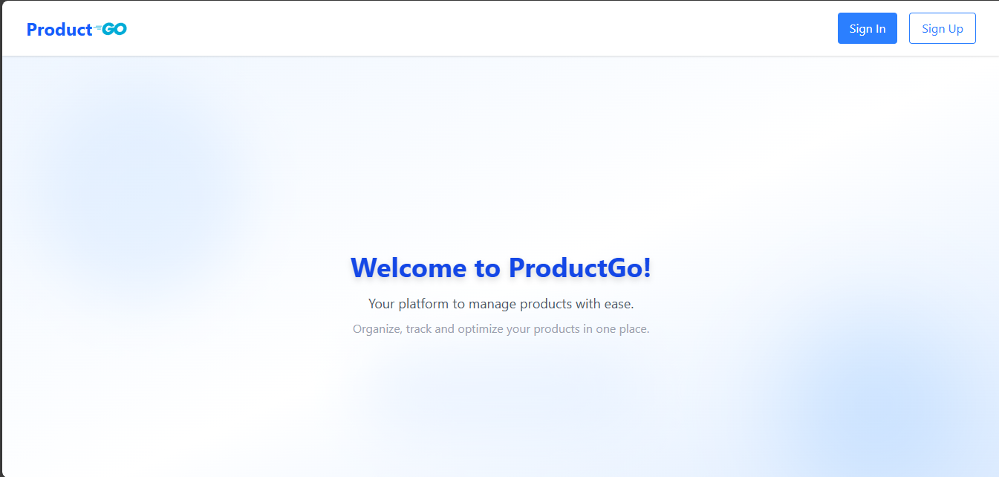 | 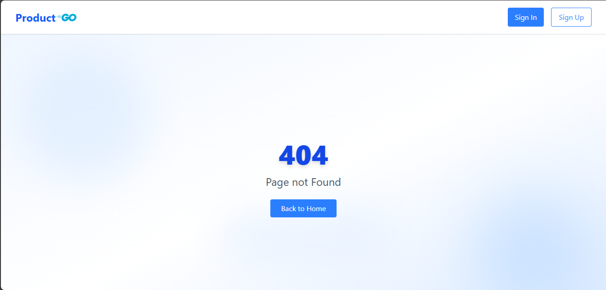 |

| Product List             | Product Detail (User)      |
|--------------------------|----------------------------|
| 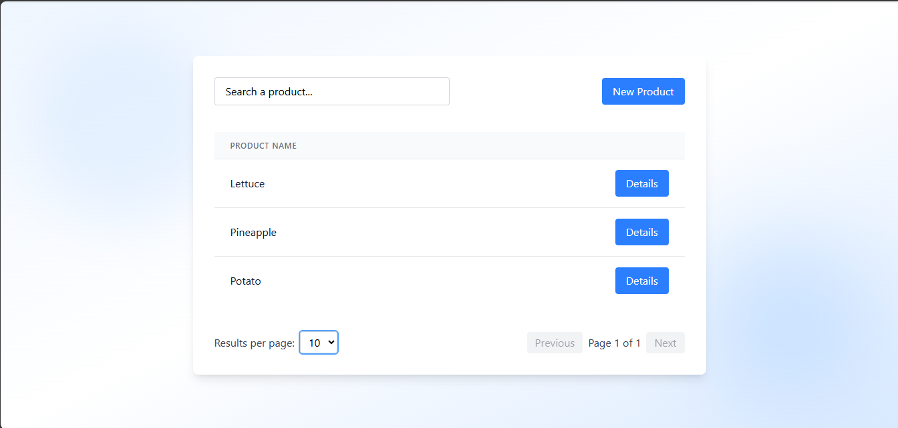 | 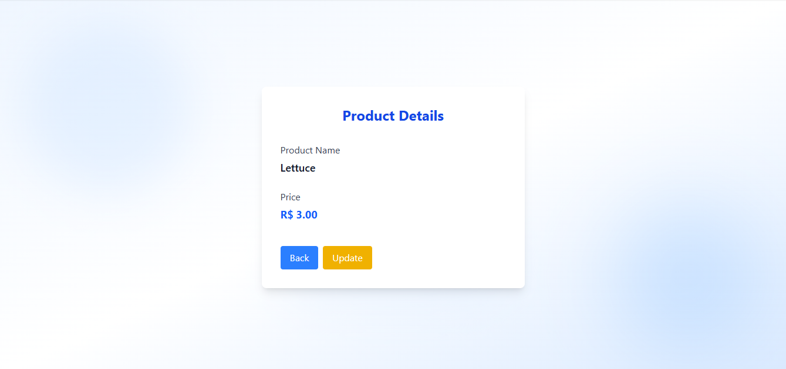 |

| Create Product           | Update Product             |
|--------------------------|----------------------------|
|  | 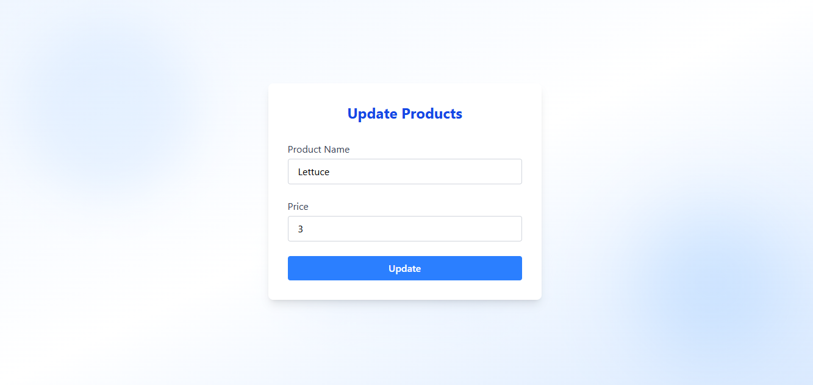 |

| Admin - Detail User      | Admin - Update User        |
|--------------------------|----------------------------|
| 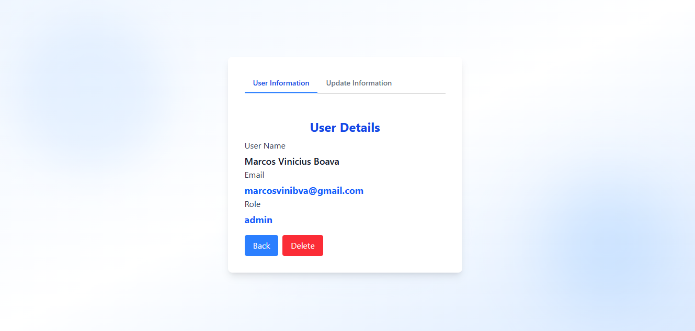 |  |

| Login                     | Register                  |
|---------------------------|---------------------------|
| 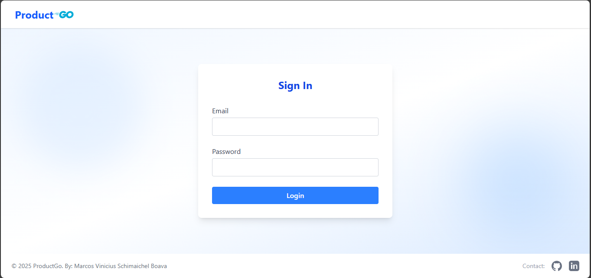 | 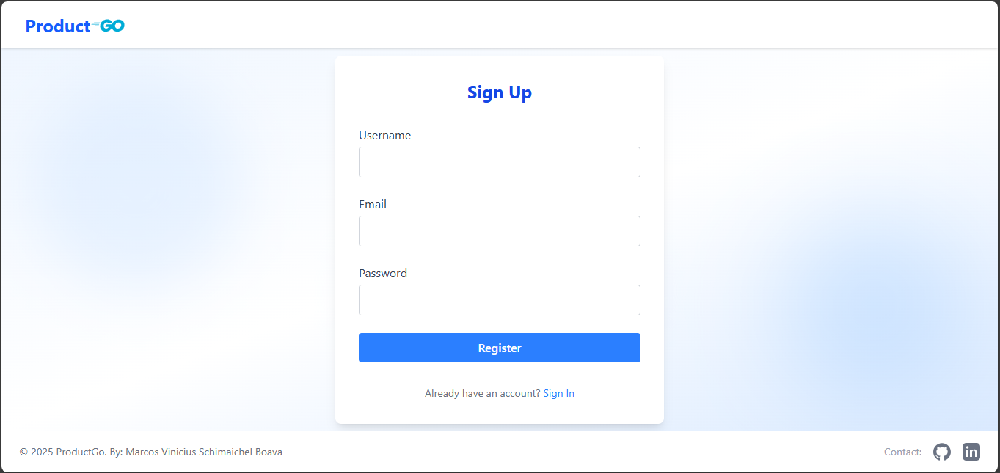 |

| User Navbar               | Admin Navbar              |
|---------------------------|---------------------------|
| 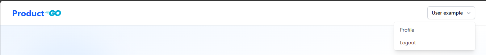 | 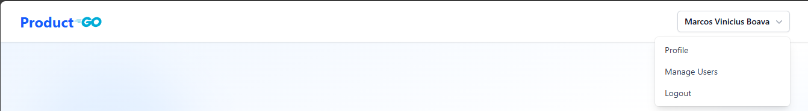 |

| User Informations         | Update Profile            |
|---------------------------|---------------------------|
| 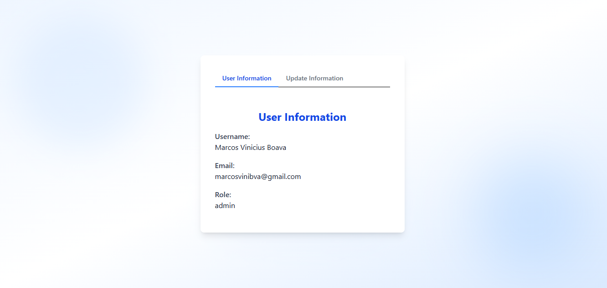 | 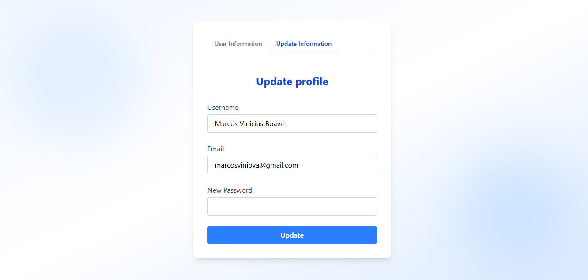 |

| Admin - Detail Product    | Admin - ManageUsers       |
|---------------------------|---------------------------|
| 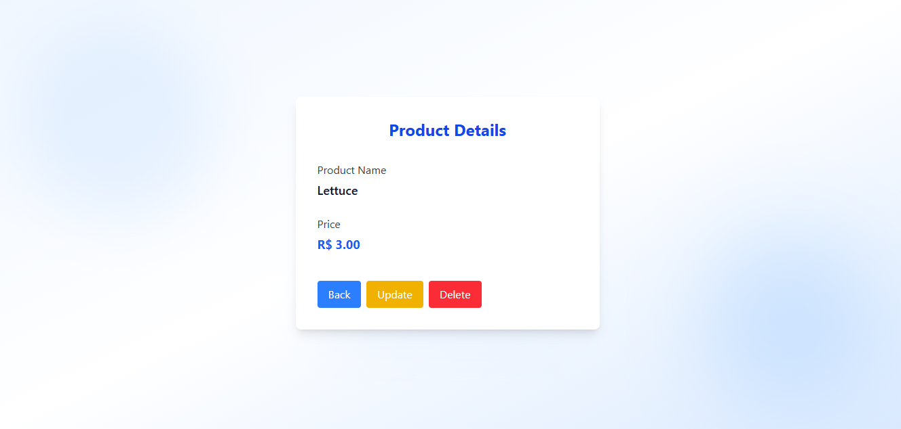 | 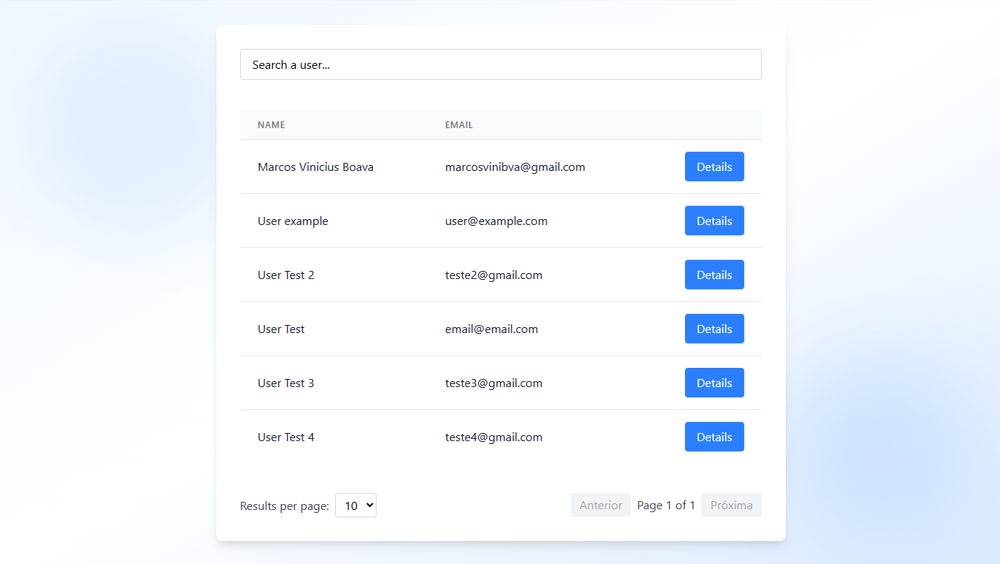 |

| Admin - Detail User - Restricted | Success Alert      |
|---------------------------|---------------------------|
| 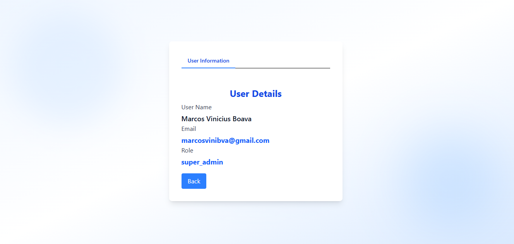 | 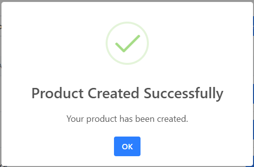 |

| Confirmation Alert        | Error Alert               |
|---------------------------|---------------------------|
| 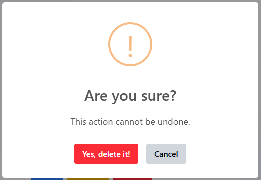 | 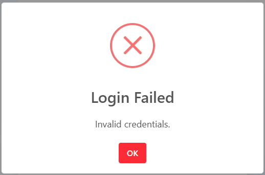 |

All screenshots are located in the [`screenshots/`](screenshots) folder.

---

## Useful Links 🔗

- [Product Go API Backend](https://github.com/Mfrozzz/product-go-api)
- [Angular CLI Documentation](https://angular.dev/tools/cli)
- [Angular Documentation](https://angular.dev/overview)

---

Developed by [Marcos Vinicius Boava](https://github.com/Mfrozzz).